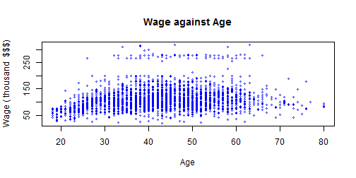

--- 

title       : Dealing with Non-Linearity
subtitle    : Demonstrating 4 Different Non-Linear Models
author      : Narendra S. Shukla (October '2015)
job         : 
framework   : io2012        # {io2012, html5slides, shower, dzslides, ...}
highlighter : highlight.js  # {highlight.js, prettify, highlight}
hitheme     : tomorrow      # 
widgets     : [mathjax, bootstrap]            # {mathjax, quiz, bootstrap}
mode        : selfcontained # {standalone, draft}
knit        : slidify::knit2slides


--- #custbg

## What is this App about ?

<style> 
#custbg {
  background-color: #EDE0CF;
}  
</style>

<p style = "font-size:14pt;"><b>Introduction : </b> &nbsp; &nbsp;&nbsp;&nbsp;&nbsp;&nbsp;&nbsp;&nbsp;
(The App can be accessed by clicking

<a href="https://narenshukla.shinyapps.io/FittingModelsToNonLinearData"> <b>here </b></a>)

<p style = "font-size:12pt;">When <b>relationship</b> between <b>Predictors and Response variable</b> is <b>Non-Linear</b>, Linear models often <b>perform poorly</b>. This mandates us to consider <b>alternatives</b>.
 Let's look at the <b>Wage</b> data against <b>Age</b>,from <b>ISLR</b> package.
</p>


```r
library (ISLR)
plot(Wage$age, Wage$wage, xlim=range(Wage$age) ,cex =.5, col ="blue",
     xlab="Age", ylab="Wage ( thousand  $$$)", main="Wage against Age")
```

 

<p style = "font-size:12pt;">As you can see, this <b>relationship</b> is <b>Non-Linear</b>.
We now show <b>4 different models</b>, which handle this <b>Non-Linearity</b> in the data. </p>

--- #custbg 

<style> 
#custbg {
  background-color: #EDE0CF;
}  
</style>

## Polynomial Regression

<p style = "font-size:12pt;">This can be represented by,</p>

$y_i = \beta_0 + \beta_1 x_i + \beta_2 x_i^2 + \beta_3 x_i^3 + ... + \beta_d x_i^d + \epsilon_i$

<p style = "font-size:12pt;"><b>Observations : </b>
&nbsp;&nbsp;&nbsp;&nbsp;&nbsp;&nbsp;&nbsp;
(Model's <b>Chart</b> is shown in the <b>App</b>)
<ol><li style = "font-size:12pt;">This model obtains extra predictors by <b>raising</b> each original predictor to a <b>power</b>. </li>
<li style = "font-size:12pt;"> The <b>correct Degree of Polynomial</b> to apply, could be chosen either by <b>ANOVA or Cross-Validation</b> </li>
</ol></p>


## Regression Splines, including Natural Splines (Piecewise Polynomials)

<p style = "font-size:12pt;">A <b>Cubic Spline</b> with <b>K knots</b> can be modelled as,</p>

$y_i = \beta_0 + \beta_1 b_1(x_i) + \beta_2 b_2(x_i) + ... + \beta_{K+3} b_{K+3}(x_i) + \epsilon_i$

<p style = "font-size:12pt;">where b1, b2, ... $b_{K+3}$ are appropriate choice of <b>Basis Functions</b>. 

A <b>truncated power basis function</b> can be added per <b>knot</b>, </p>

$h(x,\xi) = (x - \xi)_+^3 = \begin{cases} (x - \xi)^3 & \text{if x > } \xi \\ 0 & \text{otherwise} \end{cases}$

---  #custbg

<style> 
#custbg {
  background-color: #EDE0CF;
}  
</style>

## Regression Splines (...Continued)

<p style = "font-size:12pt;"><b>Observations : </b>
&nbsp;&nbsp;&nbsp;&nbsp;&nbsp;&nbsp;&nbsp;
(Model's <b>Chart</b> is shown in the <b>App</b>)

<ol><li style = "font-size:12pt;">Splines fit <b>low-degree polynomials</b> over different regions specified by <b>KNOTS</b> </li>
<li style = "font-size:12pt;">They can be represented by <b>Basis Functions</b>. <b>Default Degree is 3</b>, which yields <b>Cubic Splines</b> </li>
<li style = "font-size:12pt;">In our app, we have <b>pre-specified knots</b> at ages <b>25, 40 and 60</b>. This produces a <b>Spline</b> with <b>6 Basis Functions</b> </li>
<li style = "font-size:12pt;"><b>Natural Splines</b> impose <b>additional boundary constraints</b>. Hence they produce <b>more stable</b> estimates at <b>boundaries</b> </li>
</ol></p>


## Smoothing Splines

<p style = "font-size:12pt;">This Model can be represented as,</p>

$\sum_{i=1}^n {(y_i - g(x_i))^2} + \lambda \int g^'' (t)^2 dt$ 
<p style = "font-size:12pt;">where $\lambda$ is a non-negative <b>tuning parameter</b> and ($\lambda \int g^'' (t)^2 dt$) is a <b>penalty term</b> that penalizes the <b>variability</b> in g </p>

<p style = "font-size:12pt;"><b>Observations : </b>
&nbsp;&nbsp;&nbsp;&nbsp;&nbsp;&nbsp;&nbsp;
(Model's <b>Chart</b> is shown in the <b>App</b>)

<ol><li style = "font-size:12pt;">Smoothing Splines take the form of <b>Loss + Penalty</b> </li>
<li style = "font-size:12pt;">It is <b>shrunken version</b> of <b>Natural Cubic Spline</b> with <b>Knot</b> at <b>each observation</b> </li>
<li style = "font-size:12pt;">Tuning parameter $\lambda$ controls the <b>Level of Shrinkage</b>, it also controls the <b>roughness</b> of the smoothing spline </li>
<li style = "font-size:12pt;">When $\lambda$ = 0, then the penalty term has <b>No Effect</b>. When $\lambda$ = $\infty$, g will be <b>Perfectly Smooth</b> </li>
</ol></p>

---  #custbg

<style> 
#custbg {
  background-color: #EDE0CF;
}  
</style>

## Local Regression

<p style = "font-size:12pt;"><b>Observations : </b>
&nbsp;&nbsp;&nbsp;&nbsp;&nbsp;&nbsp;&nbsp;
(Model's <b>Chart</b> is shown in the <b>App</b>)</p>

<p>
<ol><li style = "font-size:12pt;">It computes the fit using <b>Weighted Least Squares</b> of nearby Observations, determined by <b>SPAN</b> </li>
<li style = "font-size:12pt;">The <b>larger</b> the span, the <b>smoother</b> the fit. <b>Cross-Validation</b> can be used to choose the <b>Correct Span</b> </li>
</ol>
</p>


## Concluding Remarks

<p style = "font-size:12pt;">
<ol>
<li style = "font-size:12pt;"> The App <b>clearly demonstrates</b> fitting <b>Non-Linear</b> Models to <b>Non-Linear</b> Data. Linear Models <b>are unable to</b> serve the purpose in this case </li> 
<li style = "font-size:12pt;">Much of the <b>recent research</b> in statistical learning has been concentrated on <b>Non-Linear methods</b> </li>
<li style = "font-size:12pt;">They offer <b>significant improvements</b> in terms of <b>prediction power</b>, when data is <b>Non-Linear</b> </li>
<li style = "font-size:12pt;">A <b>key to success</b> is, to choose <b>right set of parameters</b> (eg. <b>Polynomial Degree, Number of Knots, Degree of Freedom, Span </b>etc), while <b>applying</b> individual models </li>  
</ol>
</p>


## References

<p>
<ol><li style = "font-size:12pt;"><b>Non-Linear Model</b> details are acquired from <b>An Introduction to Statistical Learning with Applications in R</b> . 
Read more: &nbsp;
<a href="http://www-bcf.usc.edu/~gareth/ISL/"> <b>here </b></a>
</li></ol>
</p>


